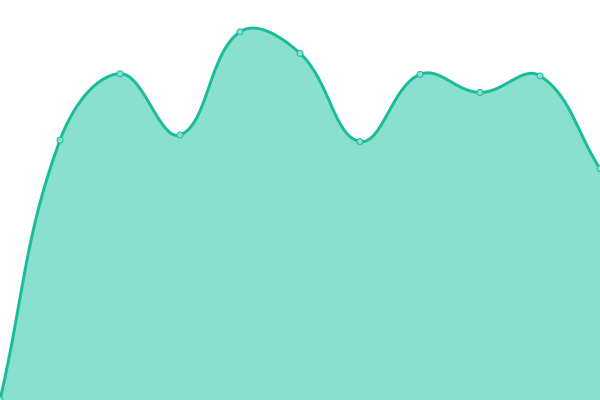
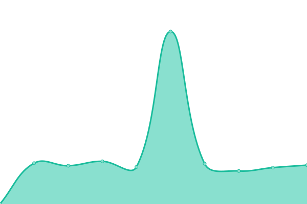
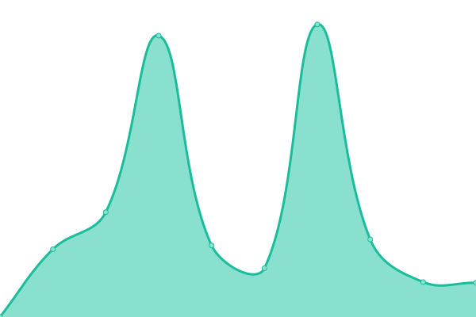
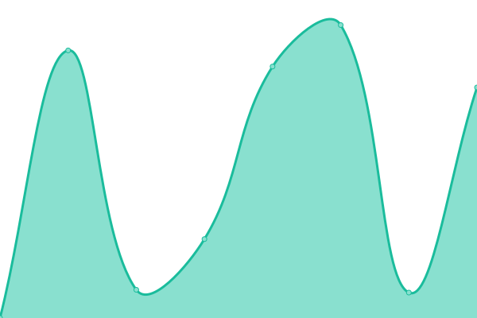
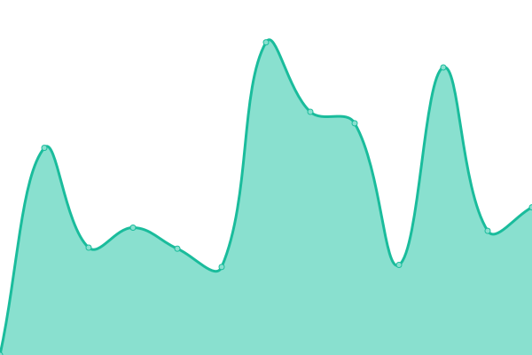

# [📈 Live Status](https://status.yukb.id): <!--live status--> **🟧 Partial outage**

This repository contains the open-source uptime monitor and status page for [yukbid](https://status.yukb.id), powered by [Upptime](https://github.com/upptime/upptime).

With [Upptime](https://upptime.js.org), you can get your own unlimited and free uptime monitor and status page, powered entirely by a GitHub repository. We use [Issues](https://github.com/yukbid/upptime/issues) as incident reports, [Actions](https://github.com/yukbid/upptime/actions) as uptime monitors, and [Pages](https://status.yukb.id) for the status page.

<!--start: status pages-->
<!-- This summary is generated by Upptime (https://github.com/upptime/upptime) -->
<!-- Do not edit this manually, your changes will be overwritten -->
<!-- prettier-ignore -->
| URL | Status | History | Response Time | Uptime |
| --- | ------ | ------- | ------------- | ------ |
|  [Home](https://yukbid.com) | 🟩 Up | [home.yml](https://github.com/yukbid/upptime/commits/HEAD/history/home.yml) | 

 5971ms
     
 | 

<a href="https://status.yukb.id/history/home">100.00%</a>
    

|  API Server | 🟩 Up | [api-server.yml](https://github.com/yukbid/upptime/commits/HEAD/history/api-server.yml) | 

 4680ms
     
 | 

<a href="https://status.yukb.id/history/api-server">98.82%</a>
    

|  Hubs | 🟩 Up | [hubs.yml](https://github.com/yukbid/upptime/commits/HEAD/history/hubs.yml) | 

 6476ms
     
 | 

<a href="https://status.yukb.id/history/hubs">98.30%</a>
    

|  Admin | 🟥 Down | [admin.yml](https://github.com/yukbid/upptime/commits/HEAD/history/admin.yml) | 

 6318ms
     
 | 

<a href="https://status.yukb.id/history/admin">72.59%</a>
    

|  Microservices | 🟩 Up | [microservices.yml](https://github.com/yukbid/upptime/commits/HEAD/history/microservices.yml) | 

 2188ms
     
 | 

<a href="https://status.yukb.id/history/microservices">100.00%</a>
    

<!--end: status pages-->

[**Visit our status website →**](https://status.yukb.id)

## 📄 License

- Powered by: [Upptime](https://github.com/upptime/upptime)
- Code: [MIT](./LICENSE) © [yukbid](https://status.yukb.id)
- Data in the `./history` directory: [Open Database License](https://opendatacommons.org/licenses/odbl/1-0/)
